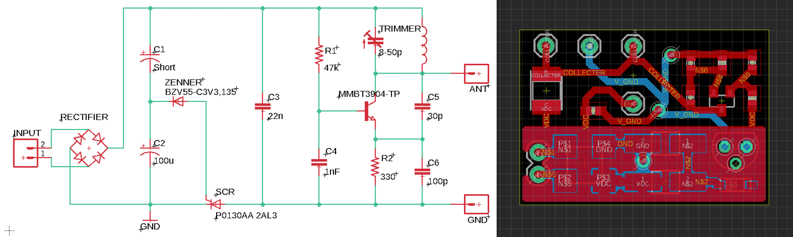

# Sozu
Open Source for Sozu: Self-Powered Radio Tags for Building-Scale Activity Sensing (to appear at [UIST 2019](http://uist.acm.org/uist2019/))

## About

Sozu a low-cost sensing system that can detect a wide range of events wirelessly, through walls and without line of sight, at whole-building scale. Instead of using batteries, Sozu tags convert energy from activities that they sense into RF broadcasts, acting like miniature self-powered radio stations.

[Youtube Video]
[Paper]
[Citation format]

### Sozu Toolkit
we created a toolkit that consists of a Sozu tag connected to a solar cell, an RTL-SDR, a set of antennas, and demo code. We also wrote a quick [start guide](https://github.com/FIGLAB/Sozu/tree/master/toolkit) on how to set up the software, deploy Sozu tags, and receive signals:

### Request Toolkit
Please fill out the google form below for your toolkit request.

[google form url]

For bulk and commercial orders place email us at info@figlab.com

## Resources
### Sozu Tags
PCB design files can be found here: https://github.com/FIGLAB/Sozu/tree/master/pcb

### HackRF version

[to be added]
