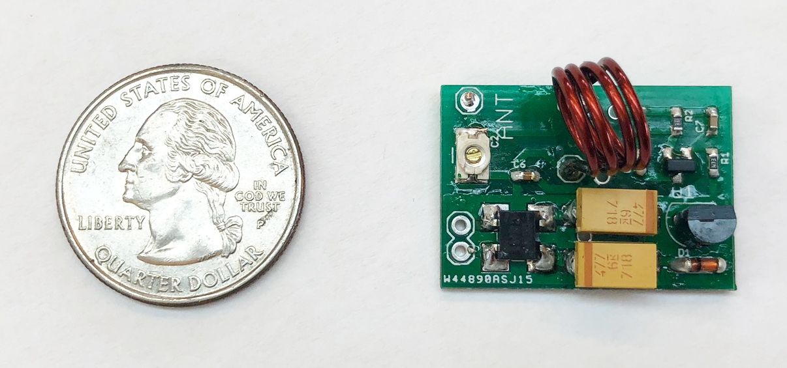

# Sozu
Open Source for Sozu: Self-Powered Radio Tags for Building-Scale Activity Sensing (to appear at [UIST 2019](http://uist.acm.org/uist2019/))

Sozu a low-cost sensing system that can detect a wide range of events wirelessly, through walls and without line of sight, at whole-building scale. Instead of using batteries, Sozu tags convert energy from activities that they sense into RF broadcasts, acting like miniature self-powered radio stations.

## Sozu Tags

## PCB design files

