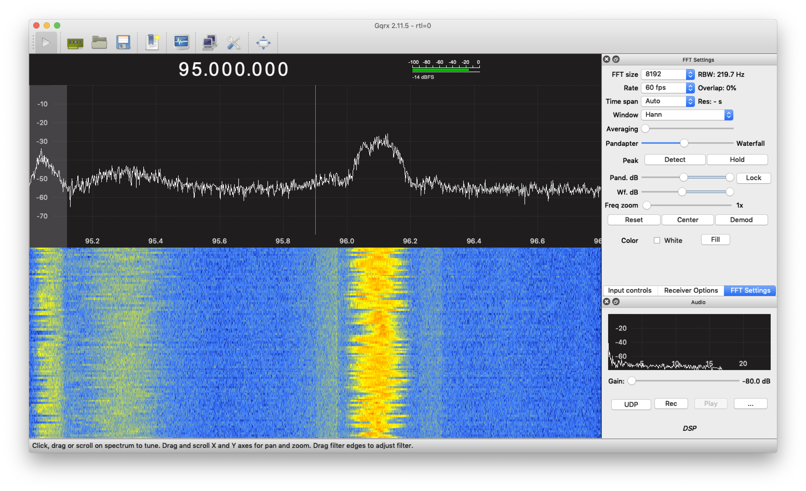

# Sozu Toolkit

This is a quick start guide for Sozu toolkit.

## What are included in the toolkit
*  A Sozu tag powered by a small [solar panel](https://www.digikey.com/product-detail/en/panasonic-bsg/AM-8801CAR/869-1016-ND/2165201)
*  One alligator clip
*  [RTL-SDR + antenna](https://www.amazon.com/dp/B011HVUEME/ref=cm_sw_em_r_mt_dp_U_lSCGCbVDHKKQQ)

## Set up Sozu on your laptop

### Step 1: Connect the SDR with antenna (two long ones), and connect it to the laptop:


### Step 2: Install software

Sozu receiver is based on SDR. In this tutorial, we will use RTL-SDR. The easiest way to get data out of RTL-SDR is to use [pystlsdr](https://nocarryr.github.io/pyrtlsdr/) -- A Python wrapper for librtlsdr (a driver for Realtek RTL2832U based SDR’s). Python3 is required (3.7.4 was tested).

Steps to below to install librtlsdr and run Sozu demo code:

1. Install pyrtlsdr via [pip](https://pip.pypa.io/en/stable/):  

```bash
pip install pyrtlsdr
```

2. Install librtlsdr via [brew](https://brew.sh):  

```bash
brew install librtlsdr
```


3. Download Project Sozu source code from the [Github Page](https://github.com/FIGLAB/Sozu) or

```bash
git clone git@github.com:FIGLAB/Sozu.git
```

4. Now plug in the SDR with the antenna connected (through USB) and get the RF signal from your environment by running the python code (./software/Python/demo_waterfall.py):

```bash
python demo_waterfall.py
```


If you can see the above output on your python window, you are ready to receive RF signals from Sozu tags!

### Step 3: Deploy Sozu tag in the environment
1. Deploy harvesters in the environment (if you are looking for examples, we have a [webpage](https://FIGLAB.com/) which shows how we harvest energy from a wide range of objects)

2. Make sure harvester provides higher than 1.5 Volts from the activity that you are interested in sensing using the multimeter.

3. Connect the energy harvester to the Sozu tag.

### Step 4: Locate the Sozu signal on the frequency spectrogram

1. Run the Python server code(./software/Python/demo_waterfall_server.py):


2. Tune the center frequency of your SDR around the Sozu tag frequency (labeled on the back of the tag), until you see its signal on the waterfall chart:


After you have located the signal, you are ready to make applications out of it!

### Step 5 (optional):  Visualize and process Sozu signals with other programs

The Python code functions as a TCP server, ready to stream data out to any programs you want to use in your project. Here we demonstrate getting Sozu signals with Processing.

1. Download and install Processing from [https://processing.org](https://processing.org)

2. Run the Processing client code (./software/Processing/client/client.pde). Now you should see the Sozu signal shown in the Processing app:


## Debug Sozu

### Gqrx
[Gqrx](http://gqrx.dk) is a useful software to interface SDRs with a nice UI, which you can use and tune many parameters (e.g., sampling rate, center frequency, averaging etc.) for debug.



### Known issues
#### OSError: Error code -3 when opening SDR (device index = 0)
Solution: Unplug the SDR from the USB, and plug it back in.

#### AttributeError: dlsym(RTLD_DEFAULT, rtlsdr_get_device_count): symbol not found
Solution: Try brew install librtlsdr again.
