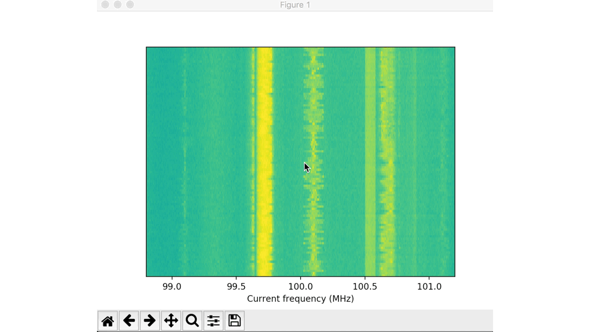
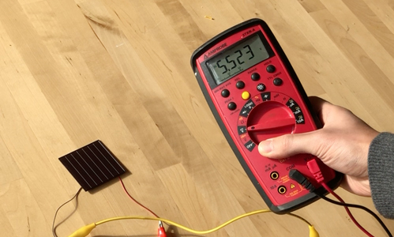
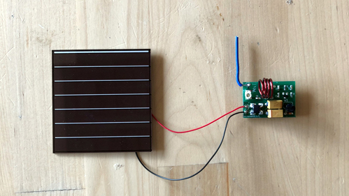
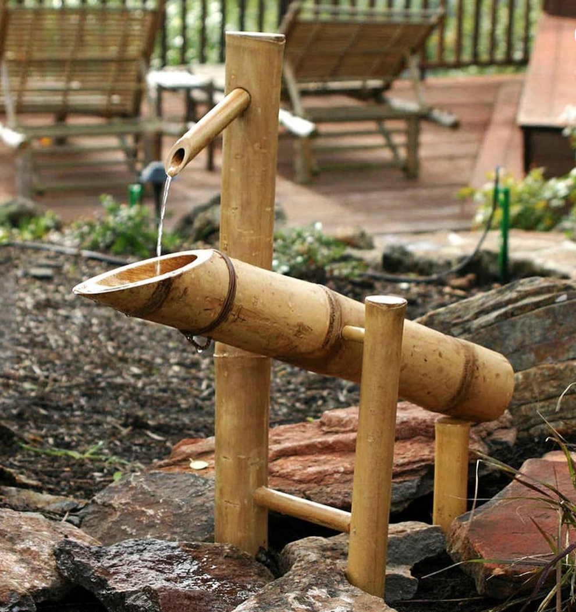

# Sozu Toolkit

This is a quick start quide for Sozu toolkit.

## Preparation

### Hardware 
*  Energy harvesters depending on your application (e.g., Solar cell, DC motor, Piltier junction etc.)
*  A Multimeter for debug
*  A solder iron
*  Some alligator clips
*  [SOZU tags](https://github.com/FIGLAB/sozu/blob/master/images/pcb.jpg)
*  [RTL-SDR + antenna](https://www.amazon.com/dp/B011HVUEME/ref=cm_sw_em_r_mt_dp_U_lSCGCbVDHKKQQ)

### Software

SOZU receiver is based on SDR. In this tutorial, we will use RTL-SDR. The easiest way to get data out of RTL-SDR is to use [pystlsdr](https://nocarryr.github.io/pyrtlsdr/) -- A Python wrapper for librtlsdr (a driver for Realtek RTL2832U based SDR’s). Python3 is required.

Steps to below to install librtlsdr and run SOZU demo code:

1. Install pyrtlsdr via [pip](https://pip.pypa.io/en/stable/):  

```bash
pip install pyrtlsdr
```

2. Install librtlsdr via [brew](https://brew.sh):  

```bash
brew install librtlsdr
```

2. Download and install Processing from [https://processing.org](https://processing.org)


3. Download Project SOZU source code from the [Github Page](https://github.com/FIGLAB/sozu) or 

```bash
git clone git@github.com:FIGLAB/sozu.git
```

4. Now plug in the SDR with the antenna connected (through USB) and get the RF signal from your environment by running the python code (./software/Python/demo_waterfall.py):

```bash
python demo_waterfall.py
```


If you can see the above output on your python window, you are ready to receive RF signals from SOZU tags!

## Usage
### Step 1: Deploy SOZU sensor in the environment
1. Deploy harvesters in the environment (If you are looking for examples, we have a [webpage](https://FIGLAB.com/) that shows how we harvest energy from a wide range of objects)

2. Make sure harvester provides higher than 1.5 Volts from the activity that you are interested in sensing using the multimeter:



3. Connect the energy harvester to the SOZU tag:



### Step 2: Get the SOZU signal in Processing

1. Connect the SDR with antenna (two long ones), and connect it to the laptop:


2. Run the Python server code(./software/Python/demo_waterfall_server.py):


3. Tune the center frequency of your SDR around the SOZU tag frequency (labeled on the back of the tag), until you see its signal on the waterfall chart: 


4. Run the Processing client code. Now you should see SOZU tag's signal shown in the Processing app: 


### Step 3: Build your applications 

After you can see the signal in the processing app, you are now ready to make applications!


## Debugging SOZU 

### Using Gqrx 

[Gqrx](http://gqrx.dk) is a useful software to interface SDRs with a nice UI, which you can use and tune many parameters (e.g., sampling rate, center frequency, averaging etc.) for debug 

Other issues:

Problem: OSError: Error code -3 when opening SDR (device index = 0)
Solution: Unplug the SDR from the USB, and plug it back in.

Problem: AttributeError: dlsym(RTLD_DEFAULT, rtlsdr_get_device_count): symbol not found
Solution: Try brew install librtlsdr again.


(We will look for breakdowns in the evaluation such as frequency searching, signal range, interference from noise/other tags etc.)

## About

The project name SOZU takes inspiration from Japanese water device which emits sound of the bamboo rocker arm hitting rocks once collects enough water, to startle any herbivores such as deer or boars which may be grazing on the plants in the garden:



## Copyright and License

This project should be kept within the team before it is published (expected Mid October 2019).  
