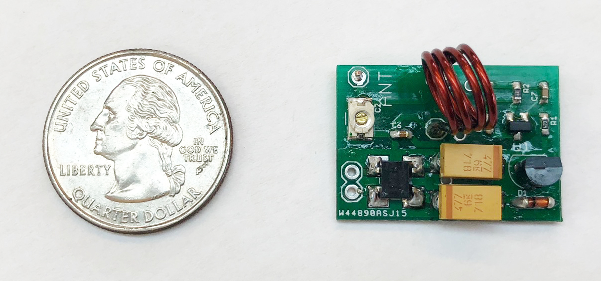

## Sozu Toolkit
To facilitate others' hands-on experience with Sozu, we created a toolkit which consists of a solar powered Sozu tag, an RTL-SDR, a set of antennas, demo code, and a quick start guide:


### Step 1: Make sure you have everything
You will find the following parts in the box:
*  A Sozu tag powered by a small [solar panel](https://www.digikey.com/product-detail/en/panasonic-bsg/AM-8801CAR/869-1016-ND/2165201)
*  One alligator clip
*  [RTL-SDR + antenna](https://www.amazon.com/dp/B011HVUEME/ref=cm_sw_em_r_mt_dp_U_lSCGCbVDHKKQQ)

### Step 2: Connect the SDR with antenna (two long ones), and connect it to the laptop:


### Step 3: Install software

Sozu receiver is based on SDR. In this tutorial, we will use RTL-SDR. The easiest way to get data out of RTL-SDR is to use [pystlsdr](https://nocarryr.github.io/pyrtlsdr/) -- A Python wrapper for librtlsdr (a driver for Realtek RTL2832U based SDR’s). Python3 is required (3.7.4 was tested).

Steps to below to install librtlsdr and run Sozu demo code:

1. Install pyrtlsdr via [pip](https://pip.pypa.io/en/stable/):  

```bash
pip install pyrtlsdr
```

2. Install librtlsdr via [brew](https://brew.sh):  

```bash
brew install librtlsdr
```

3. Download Project Sozu source code from the [Github Page](https://github.com/FIGLAB/Sozu) or

```bash
git clone git@github.com:figlab/Sozu.git
```

4. Now plug in the SDR with the antenna connected (through USB) and get the RF signal from your environment by running the python code (./toolkit/software/Python/demo_waterfall.py):

```bash
python demo_waterfall.py
```


If you can see the above output on your python window, you are ready to receive RF signals from Sozu tags!

### Step 4: Deploy Sozu tag in the environment
1. Deploy harvesters in the environment.

2. If you use a different energy harvester, use a multimeter to make sure the harvester provides higher than 1.5 Volts from the activity that you are interested in sensing.

3. Connect the energy harvester to the Sozu tag.

### Step 5: Locate the Sozu signal on the frequency spectrogram

1. Run the Python server code(./toolkit/software/Python/demo_waterfall_server.py):


2. Tune the center frequency of your SDR around the Sozu tag frequency (labeled on the back of the tag), until you see its signal on the waterfall chart:


After you have located the signal, you are ready to make applications out of it!

### Step 6 (optional):  Visualize and process Sozu signals with other programs

The Python code (./toolkit/software/Python/demo_waterfall_server.py) functions like a TCP server, ready to stream data out to any programs you want to use in your project. Here we demonstrate getting Sozu signals with Processing.

1. Download and install Processing from [https://processing.org](https://processing.org)

2. Run the Processing client code (./toolkit/software/Processing/client/client.pde). Now you should see the Sozu signal shown in the Processing app:


3. Finally, connecting the alligator cable to the tag antenna as an extension helps improve the broadcast range.

### Request Sozu Toolkit
Please fill out the google form below for your toolkit request: https://forms.gle/UTFnRSarYxjS2oz19

For bulk orders and commercial collaborations, please email us at info@figlab.com

Contact yang.zhang@cs.cmu.edu for any other questions.

## Other Resources
### What does the name Sozu mean

Sozu – comes from the traditional Japanese water feature, where a bamboo segment slowly fills with water, eventually causing its center of mass to shift, such that it pivots downwards, striking a rock (designed to scare away animals in gardens). This is similar in principle to our system, where one form of energy is converted into another for practical use.


### See what others created with Sozu
Auxiliary video of example projects: https://youtu.be/Q_soA7qurLE

### Sozu tags
PCB design files: https://github.com/FIGLAB/Sozu/tree/master/pcb



### Common issues

#### Cannot find Sozu tag frequency
Solution: Try to move the Sozu tag closer to the receiver. It is also possible that Sozu tag frequency shifted since the spacing of the inductor coil and the trimmer capacitor might change over shipping. To locate tag frequency, please tune the center frequency of your spectrogram visualizer around the labeled frequency on the back of the Sozu tag. It is easier to locate the frequency with Gqrx and use a SDR with wider bandwidth (e.g., [HackRF](https://greatscottgadgets.com/hackrf/one/) has a 20MHz bandwidth)

#### OSError: Error code -3 when opening SDR (device index = 0)
Solution: Unplug the SDR from the USB, and plug it back in.

#### AttributeError: dlsym(RTLD_DEFAULT, rtlsdr_get_device_count): symbol not found
Solution: Try brew install librtlsdr again.
